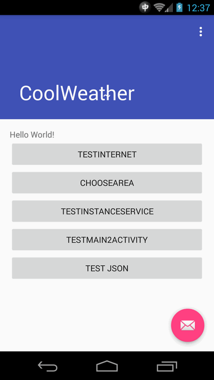
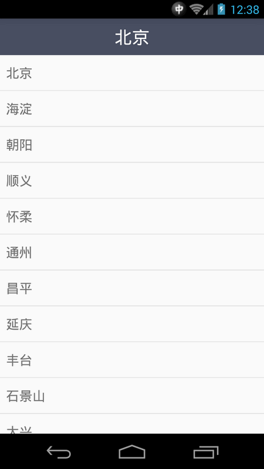
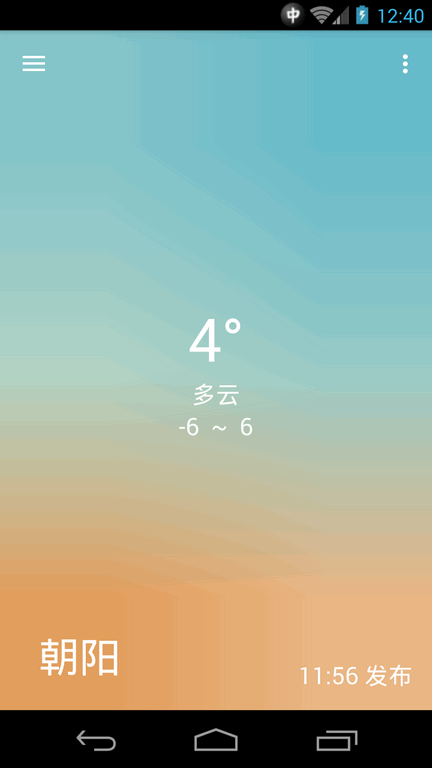
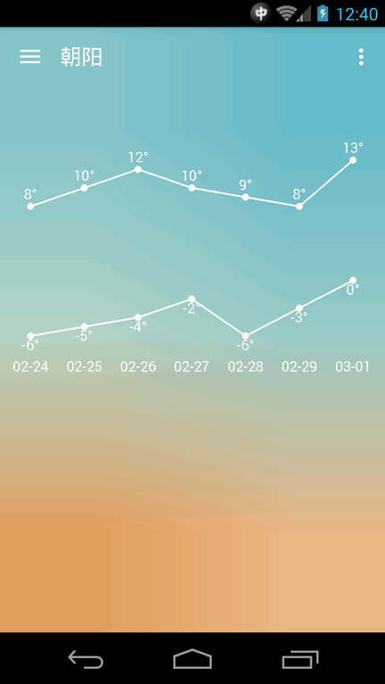

#CoolWeather

根据《第一行代码》写了自己用的天气预报软件。

**和风天气的KEY需要开发者自己注册，应用启动后输入，拼接URL的时候读取。**

**由于作者对于界面设计没有一点审美，部分界面及交互借鉴了PureWeather [@95han](https://github.com/95han)  如有侵权，马上改正。**

### 2016.06.23

- 将旧的不符合MVP的Activity进行改造。
- 提取用到的常量到常量接口中。

### 2016.06.19

- transparent weather Activity's status bar.

###2016.02.21

美化主界面背景图片，[来源](https://dribbble.com/shots/2227157-Free-iPhone-Backgrounds)

尝试使用MVP模式构建。

###11.26

使用本地广播实现UI线程Toast提示选中的城市不支持。没找到在后台线程中获取UI线程Handler的方法，无法直接在Utility中发出Toast或是发送Message给UI线程。

###2015.11.13 update

更新使用和风天气API，但是目前和风天气没有提供分级城市选择的Json，于是利用之前的Json来选择城市，造成新的Bug，有的城市不支持。表现为选择了城市，但是天气里面并没有更新。下一步找一个不用广播的方法显示提示Toast。

###Older

目前使用的API已过期，待更换。

编写代码时候的收获。[FAQ](https://github.com/alwaystest/CoolWeather/blob/master/FAQ.markdown)

### 代码引用

- OpenGL Camera Module 引用自 https://github.com/bq/OpenGLCamera
